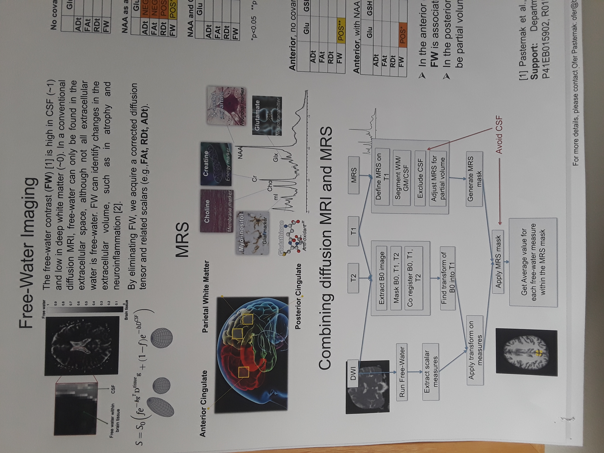

[](https://doi.org/10.5281/zenodo.2576656) []() []()

*mri2mrs* repository is developed by Tashrif Billah and Isaiah Norton.


Table of Contents
=================

   * [Combination of MRI and MRS](#combination-of-mri-and-mrs)
   * [Project flowchart](#project-flowchart)
   * [Citation](#citation)
   * [Installation](#installation)
      * [1. Dependencies](#1-dependencies)
      * [2. Setup environment](#2-setup-environment)
      * [3. MATLAB](#3-matlab)
      * [4. Clone repository](#4-clone-repository)
   * [Usage](#usage)
   * [Tests](#tests)
      * [1. git-lfs](#1-git-lfs)
      * [2. Download data](#2-download-data)
      * [3. Run tests](#3-run-tests)
      * [4. Test results](#4-test-results)
   * [Example execution](#example-execution)
   * [Parsing output](#parsing-output)
   

Table of Contents created by [gh-md-toc](https://github.com/ekalinin/github-markdown-toc)


# Combination of MRI and MRS


# Project flowchart
(Implemented rightmost column)



# Citation

If you use our software in your research, please cite as below:

Billah, Tashrif; Norton, Isaiah; Pasternak, Ofer; Combining diffusion MRI and MRS, https://github.com/pnlbwh/mri2mrs, 2018, DOI: 10.5281/zenodo.2576656
 


# Installation

You need a Linux workstation to install and run the `mri2mrs` command line module.

## 1. Dependencies
 
`mri2mrs` command line module depends on external commands like
`unu`, `DWIConvert`, `ants` etc. To build those commands on your machine, 
follow installation [instruction](https://github.com/pnlbwh/pnlpipe) 1,2,3, and 5 (upto and including `./pnlpipe std setup`).

## 2. Setup environment 

Next, we need to make the external commands available to system path: 

```
cd path/to/software/dir
cd BRAINSTools-bin-*
chmod +x env.sh
./env.sh
```

## 3. MATLAB 

Install MATLAB (it requires a license). An instruction for installing MATLAB on linux is 
available [here](https://xunyunliu.github.io/post/install_matlab/).


## 4. Clone repository 

Now that all the dependencies are solved, you can clone the `mri2mrs` repository and
start using it.

```
git clone https://github.com/pnlbwh/mri2mrs.git
cd mri2mrs
```

If the above steps are successful, help message will be correctly displayed:
`./mri2mrs.py --help`


# Usage

```
Calculates brain and white matter volumes given an MRS (Magnetic Resonance Spectroscopy)
label map and a T1 image registered in the space MRS.
Dependencies on bet, fslmaths, fast, fslswapdim, fslstats, ConvertBetweenFileFormats, matlab, Slice.
Uses Ofer's MATLAB code (SIEMENS machine) for creating MRS region mask.

Usage:
    mri2mrs.py [SWITCHES] 

Meta-switches:
    -h, --help                          Prints this help message and quits
    --help-all                          Prints help messages of all sub-commands and quits
    -v, --version                       Prints the program's version and quits

Switches:
    -b, --betThreshold VALUE:str        threshold for bet mask creation; the default is 0.3
    -c, --caseID VALUE:str              case ID; required
    -i, --input VALUE:ExistingFile      a T1 image registered in the space of magnetic
                                        resonance spectroscopy (nrrd or nifti); required
    -m, --mask                          turn on this flag to mask the T1 image before running
                                        the pipeline. When turned on, a mask is created and the
                                        T1 image is multiplied by the mask before running
                                        further steps
    -o, --out VALUE:str                 output directory where files created during the
                                        pipeline are saved (if already exist, it will be
                                        deleted and recreated); required
    --rdaFile VALUE:ExistingFile        an rda file from the scanner defining coordinates of
                                        the ROI (acg, agm, ltemp, pcg, pwm etc.); required
    --roi VALUE:str                     region of interest (ROI) name (acg, agm, ltemp, pcg,
                                        pwm etc.); required

```

# Tests

See the following instruction to run tests upon successful installation of *mri2mrs* and dependencies:

## 1. `git-lfs`

Test data is managed by `git-lfs`. One time installation of `git-lfs` per machine is required. 
Install `git-lfs` as follows:

[Download git-lfs](https://git-lfs.github.com/) command line extension

```
tar -xzvf git-lfs-linux-*
install.sh
git lfs install
```

## 2. Download data

Now download the test data:
`git lfs pull --exclude=`


## 3. Run tests 

Finally, you should be able to run test as follows:

```
cd test_data
../mri2mrs.py -i Test_SAG_MPRAGE_1mm_isoa.nii --rdaFile MRS_tha_press.rda -c Test --roi tha -o ./mri2mrs.test -m
```

## 4. Test results

You should see the following output:

```
ROI volume:4200.0
CSF volume:0.0
WM volume:4172.0
GM volume:28.0
```


# Example execution

```
./mri2mrs.py \
-i /rfanfs/pnl-zorro/projects/VA_AcuteTBI/MRIData/RegisteredT1/BIO_0002-registeredT1.nrrd \
--roi pcg -c BIO_0002 -m \
--rdaFile /rfanfs/pnl-zorro/projects/VA_AcuteTBI/MRIData/MRS_VA_AcuteTBI/BIO_0002/BIO_0002_pcg_press.rda \
-o ./mri2mrsOutput
```


# Parsing output

In python3:

```
with open('logFileName') as f:
    volume= [line.split(':')[1] for line in f.read().split('\n') if "attr" in line]
```

You can also do `float(volume)` if necessary. 

The attr you want to grab are ROI, GM, WM, CSF while the logFileName is your log text file.
    
    
In shell:

```
volume=`grep "attr" logFileName | awk -F ":" '{print $2}'`
```


